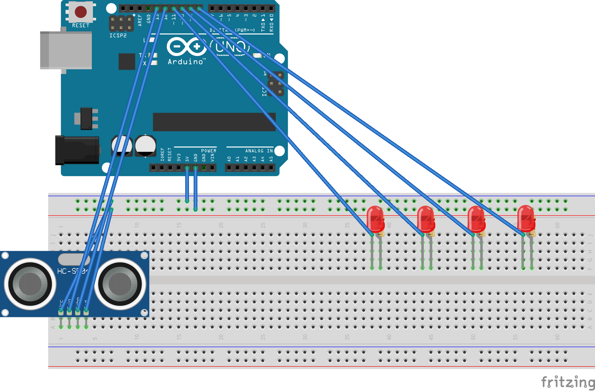

# Ultrasonic Distance Detector

### "As a driver, so that I don't back my car into the garage wall, I need an indicator to show how close my car is"
----

This is a simple Arduino project that makes use of an ultrasonic sensor to calculate
the distance to the nearest object.

#### Requires:
+ Arduino (I used an Uno)
+ HC-SR04 sensor
+ 4 LEDs (white, green, yellow, red)
+ 4 220 Ohm resistors
+ wires
+ breadboard

#### Schematic

